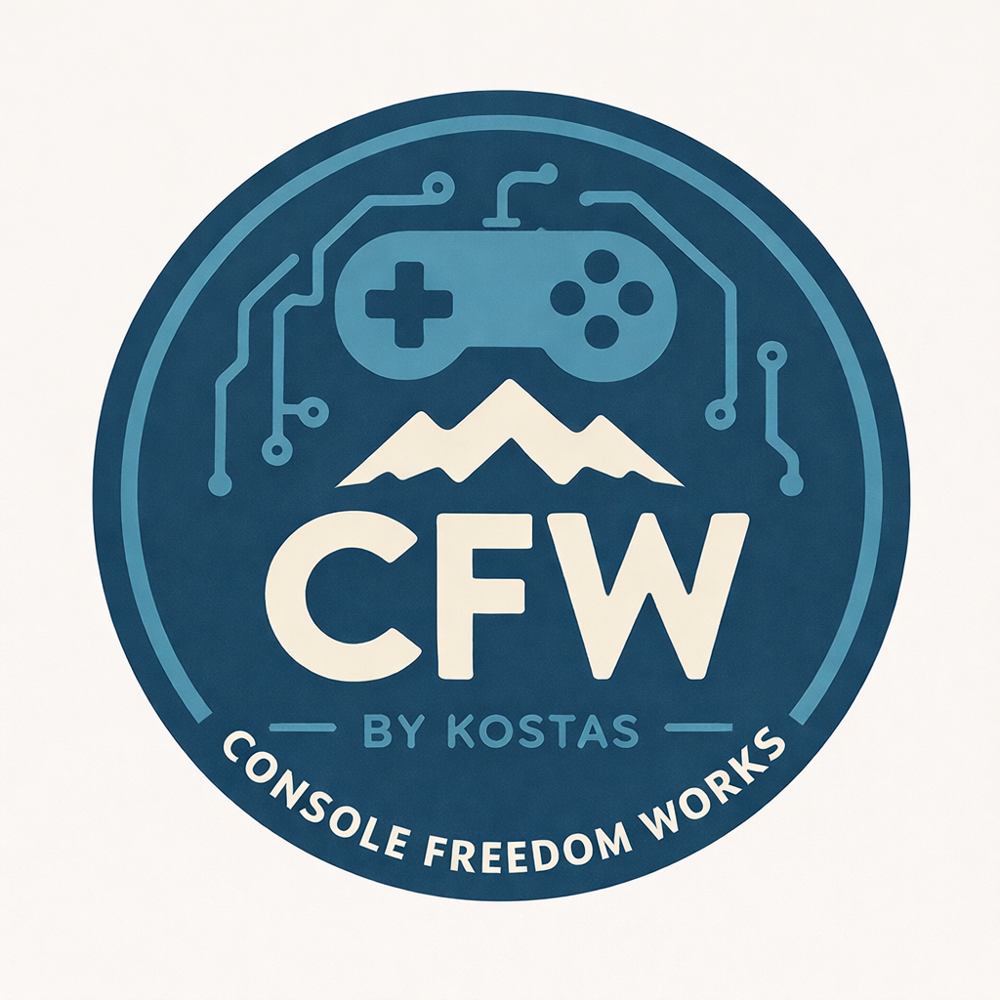

## Hi there 👋

<!--
**CFWbyKostas/cfwbykostas** is a ✨ _special_ ✨ repository because its `README.md` (this file) appears on your GitHub profile.

Here are some ideas to get you started:

- 🔭 I’m currently working on ...
- 🌱 I’m currently learning ...
- 👯 I’m looking to collaborate on ...
- 🤔 I’m looking for help with ...
- 💬 Ask me about ...
- 📫 How to reach me: ...
- 😄 Pronouns: ...
- ⚡ Fun fact: ...
-->
<!DOCTYPE html>
<html lang="el">
<head>
    <meta charset="UTF-8">
    <title>CFWbyKostas | Nintendo Switch CFW</title>
    <meta name="viewport" content="width=device-width, initial-scale=1.0">
    <link rel="stylesheet" href="style.css">
</head>
<body>

<header>
    
    <h1>CFW by Kostas</h1>
    
Console Freedome Works

</header>

<nav>
    <a href="#about">Σχετικά</a>
    <a href="#video">Βίντεο</a>
    <a href="#qna">Q&A</a>
    <a href="#contact">Επικοινωνία</a>
</nav>

<section id="about">
    <h2>Τι είναι το CFW;</h2>
    

        Το Custom Firmware (CFW) επιτρέπει να αξιοποιήσεις πλήρως
        το Nintendo Switch σου με homebrew εφαρμογές, emulators
        και άλλες δυνατότητες στη δική σου κονσόλα..
    

</section>

<section id="video">
    <h2>Βασική χρήση κονσόλας Nintendo Switch με CFW</h2>
    

        <iframe
            src="https://www.youtube.com/embed/2IMte1wF0tc"
            title="CFWbyKostas YouTube Video"
            frameborder="0"
            allow="accelerometer; autoplay; clipboard-write; encrypted-media; gyroscope; picture-in-picture"
            allowfullscreen>
        </iframe>
    

</section>

<section id="qna">
    <h2>❓ Συχνές Ερωτήσεις (Q&A)</h2>

    
Ποιος είσαι και γιατί ασχολείσαι με αυτό;

    

        Ονομάζομαι Κώστας και βρίσκομαι στην Καλαμάτα. 
        Ασχολούμαι με κονσόλες και ηλεκτρονικά κυκλώματα σχεδόν 20 χρόνια. 
        Δεν το κάνω επαγγελματικά, αλλά από αγάπη και μεράκι. 
        Πάντα μου άρεσε να πιάνω κάτι χαλασμένο, «δύσκολο» ή απαιτητικό και να το κάνω να δουλεύει σωστά. 
        Το micro soldering είναι κάτι που πραγματικά απολαμβάνω και γι’ αυτό δίνω μεγάλη σημασία στη λεπτομέρεια και όχι στην ποσότητα.
    

    
Τι πλεονεκτήματα έχει το HwFly modchip;

    

        Το HwFly modchip επιτρέπει τη χρήση custom firmware (CFW), ξεκλειδώνοντας δυνατότητες που δεν υπάρχουν στο εργοστασιακό λογισμικό της κονσόλας. 
        Είναι μια αξιόπιστη λύση που, όταν εγκατασταθεί σωστά, λειτουργεί σταθερά και με ασφάλεια, δίνοντας στον χρήστη περισσότερες επιλογές και ελευθερία στη χρήση της κονσόλας του.
    

    
Τι είναι το custom firmware (CFW);

    

        CFW σημαίνει Custom Firmware. Πρόκειται για τροποποιημένο λειτουργικό σύστημα που δίνει πρόσβαση σε δυνατότητες όπως:
        <ul>
            <li>Homebrew εφαρμογές</li>
            <li>Emulators</li>
            <li>Backup παιχνιδιών</li>
            <li>Overclock</li>
            <li>Επιπλέον εργαλεία και ρυθμίσεις</li>
        </ul>
        Με απλά λόγια, σου επιτρέπει να αξιοποιήσεις την κονσόλα σου πολύ πέρα από τα όρια του εργοστασιακού λογισμικού.
    

    
Είναι νόμιμο όλο αυτό;

    

        Η εγκατάσταση του modchip HwFly είναι νόμιμη. Η χρήση πειρατικού λογισμικού <strong>δεν</strong> είναι. 
        Η ευθύνη για το πώς θα χρησιμοποιηθεί το CFW ανήκει αποκλειστικά στον χρήστη. 
        Εγώ φροντίζω η κονσόλα να είναι σωστά στημένη και λειτουργική — η χρήση της είναι προσωπική επιλογή του καθενός.
    

    
Έχεις διαθέσιμες κονσόλες με CFW προς πώληση;

    

        Ναι. Ανά διαστήματα διαθέτω έτοιμες κονσόλες με CFW. Δεν έχω πάντα stock και δεν λειτουργώ σαν κατάστημα. 
        Οι κονσόλες που διαθέτω είναι συσκευές που έχω διαλέξει ο ίδιος, τις έχω ελέγξει και τις έχω ετοιμάσει προσωπικά, χωρίς βιασύνη και χωρίς «αρπαχτές».
    

    
Οι κονσόλες που δίνεις είναι καλές; Μπορώ να σε εμπιστευτώ;

    

        Καλή ερώτηση — και απόλυτα λογική. 🙂 
        Η αλήθεια είναι πως στην αγορά κυκλοφορούν πολλές μεταχειρισμένες κονσόλες και δυστυχώς δεν είναι όλοι το ίδιο προσεκτικοί ή ειλικρινείς. Έχουν περάσει από τα χέρια μου αρκετές συσκευές με κρυφά ή εμφανή προβλήματα, παρουσιασμένες ως «σαν καινούριες». Αυτό το θεωρώ κοροϊδία και είναι κάτι που προσωπικά δεν θα έκανα ποτέ.
          
        Για κάθε κονσόλα που δίνω:
        <ul>
            <li>Γίνεται πλήρης έλεγχος λειτουργίας (κουμπιά, Wi‑Fi, Bluetooth, θύρα φόρτισης, θερμοκρασίες κ.λπ.)</li>
            <li>Πραγματοποιείται εσωτερικός και εξωτερικός καθαρισμός</li>
            <li>Αντικαθίσταται η θερμοαγώγιμη πάστα</li>
        </ul>
        Στόχος μου δεν είναι απλώς να «δουλεύει», αλλά να είναι σωστά στημένη, αξιόπιστη και σε άριστη κατάσταση. Αν κάτι δεν με ικανοποιεί, απλά δεν το δίνω. Τόσο απλά.
    

    
Μπορώ να φέρω τη δική μου κονσόλα για εγκατάσταση modchip;

    

        Ναι, φυσικά. Μπορώ να αναλάβω την εγκατάσταση και σε δική σας κονσόλα. 
        Αρκεί να μου πείτε ποιο μοντέλο έχετε (V1 / V2 / Lite / OLED) και θα σας ενημερώσω αναλυτικά για τον χρόνο και το κόστος της διαδικασίας.
    

    
Κάνεις μόνο την εγκατάσταση του modchip;

    

        Όχι. Η δουλειά δεν σταματάει στο hardware. 
        Εκτός από την εγκατάσταση του modchip, αναλαμβάνω και την πλήρη προετοιμασία του software. 
        Γίνονται όλες οι απαραίτητες ρυθμίσεις ώστε το CFW να είναι σωστά στημένο, σταθερό και έτοιμο προς χρήση.
    

    
Τι θα χρειαστεί να στείλω για το modding στη δική μου κονσόλα;

    

        Θα χρειαστώ:
        <ul>
            <li>Μόνο την κονσόλα (χωρίς Joy‑Cons, φορτιστή ή άλλα αξεσουάρ)</li>
            <li>Μια συμβατή κάρτα μνήμης, κατά προτίμηση μεγαλύτερη των 128GB</li>
        </ul>
        Αν δεν έχετε κάρτα μνήμης, συνήθως έχω διαθέσιμες εγώ.
    

    
Μπορώ να παίξω online χωρίς ρίσκο;

    

        Ναι. Οι κονσόλες που ετοιμάζω λειτουργούν με <strong>dual boot</strong>:
        <ul>
            <li><strong>OFW:</strong> Για online παιχνίδι και eShop, χωρίς ρίσκο ban</li>
            <li><strong>CFW:</strong> Για offline χρήση, emulators και backup παιχνιδιών</li>
        </ul>
        📌 Όσο τηρείται ο διαχωρισμός, δεν υπάρχει πρόβλημα.  
        Να σημειωθεί ότι κάποια παιχνίδια (π.χ. FC 2026) απαιτούν σύνδεση στους servers της Nintendo για να λειτουργήσουν σωστά, οπότε δεν τρέχουν μέσω CFW.
    

    
Γιατί να σε εμπιστευτώ;

    

        Καταλαβαίνω απόλυτα την αμφιβολία — δεν γνωριζόμαστε και στην αγορά υπάρχουν πολλοί που δεν είναι ξεκάθαροι ή αξιόπιστοι.  
        Η δική μου προσέγγιση είναι απλή: <strong>δεν πρόκειται να κοροϊδέψω κανέναν</strong>. Ποτέ δεν θα έδινα ένα ελαττωματικό προϊόν ή κάτι που δεν είναι πλήρως λειτουργικό.  
          
        Κάθε κονσόλα που περνάει από τα χέρια μου εξετάζεται προσεκτικά. Αν υπάρξει οποιοδήποτε πρόβλημα ή ατέλεια, θα αναφερθεί ανοιχτά και καθαρά πριν την παράδοση. Δεν λειτουργώ με «τρικ» ή κρυφές λεπτομέρειες — μόνο ειλικρίνεια και προσοχή στη λεπτομέρεια.  
          
        Στόχος μου είναι να φεύγει ο καθένας με <strong>ένα προϊόν που δουλεύει σωστά, σαν να είναι καινούριο</strong>, και με την ησυχία ότι έγινε σωστή δουλειά από κάποιον που αγαπά αυτό που κάνει.
    

</section>

<section id="contact">
    <h2>📩 Επικοινωνία</h2>
    

        Για απορίες ή ενδιαφέρον σχετικά με κονσόλες και CFW,
        μπορείς να επικοινωνήσεις απευθείας μαζί μου στο email
		kostasd400@gmail.com
    

    <a href="mailto:kostasd400@gmail.com" class="contact-btn">
        Στείλε Email
    </a>
</section>

<footer>
    
© 2026 CFWbyKostas

</footer>

</body>
</html>
